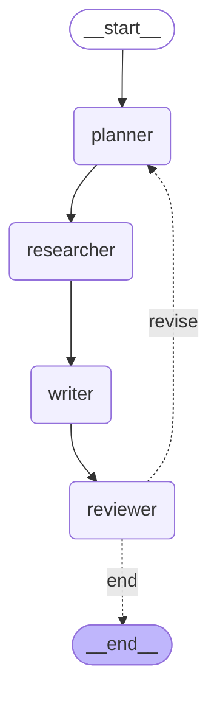

# P7: LangGraph Multi-Agent Research System

[](#tech-stack)
[](#test-results)
[](#setup)
[](#api-endpoints)

**Autonomous research agent with explicit state machine, quality loop, and streaming.** Four-node LangGraph pipeline (plan → research → write → review) with conditional edges, SQLite persistence, and FastAPI SSE streaming. Reports average ~9,000 chars with 10-15 verified sources, completes in 56-155s per topic.

## Table of Contents

- [Architecture](#architecture) — StateGraph with 4 nodes + quality loop
- [Pipeline](#pipeline) — what each node does
- [Setup](#setup) — venv, deps, API keys
- [CLI Usage](#cli-usage) — run from terminal
- [API Endpoints](#api-endpoints) — FastAPI with SSE streaming
- [Test Results](#test-results) — 5 topics verified with metrics
- [Report Structure](#report-structure) — what the output looks like
- [LangGraph Features](#langgraph-features-demonstrated) — state machine, tools, streaming, persistence
- [Framework Comparison](#framework-comparison-matrix) — P3 vs P7 vs P19
- [Cost](#cost) — verified run costs
- [Project Structure](#project-structure)

## Architecture



### Pipeline

1. **Planner** — Takes the topic (+ reviewer feedback on revisions) → generates 3-5 specific, searchable research questions
2. **Researcher** — Executes Tavily web search per question → collects results with URLs and content
3. **Writer** — Synthesizes all research notes into a structured Markdown report (Executive Summary, Key Findings, Detailed Analysis, Sources, Conclusions)
4. **Reviewer** — Evaluates report on completeness, accuracy, structure, depth, sources → scores 0-10 with detailed feedback. If score < 7 and iteration < 2, loops back to Planner with feedback

## Prerequisites

- **Python 3.12+**
- **OpenRouter API key** ([openrouter.ai](https://openrouter.ai)) — routes to Claude Sonnet 4
- **Tavily API key** ([tavily.com](https://tavily.com)) — free tier, 1000 searches/month

## Setup

```bash
# 1. Clone and create venv
cd ~/projects/langgraph-agent
python3 -m venv venv
source venv/bin/activate

# 2. Install dependencies
pip install -r requirements.txt

# 3. Configure API keys
cp .env.example .env
# Edit .env with your keys:
#   OPENROUTER_API_KEY=sk-or-...
#   TAVILY_API_KEY=tvly-...
```

## CLI Usage

```bash
python -m src.run "State of AI Coding Agents 2026"
```

Output shows live progress:

```
============================================================
  Research Topic: State of AI Coding Agents 2026
============================================================

Starting research pipeline...

[planner] completed
  1. What are the current capabilities of AI coding agents like GitHub Copilot, Cursor...
  2. Which programming languages do leading AI coding agents support most effectively...
  3. What is the adoption rate of AI coding agents among professional developers...
  4. How do AI coding agents handle complex software architecture decisions...
  5. What are the latest security and code quality concerns...

[researcher] completed
  Collected 5 research notes

[writer] completed

[reviewer] completed
  Score: 6.5/10
  → Revising (score below 7)...

[planner] completed
  ...

[reviewer] completed
  Score: 7.2/10
  → Complete!

============================================================
  RESULTS
============================================================
  Duration:   155.3s
  Iterations: 2
  Score:      6.5/10
============================================================
```

## API Endpoints

Start the server:

```bash
uvicorn src.api:app --reload
# Open http://localhost:8000/docs for Swagger UI
```

| Method | Endpoint | Description |
|---|---|---|
| POST | `/research` | Start research, returns `{id, status}` |
| GET | `/research/{id}` | Status + result (when complete) |
| GET | `/research/{id}/stream` | SSE stream of node transitions |
| GET | `/health` | Health check |
| GET | `/graph` | Mermaid diagram of the graph |

### POST /research

**Request:**
```json
{"topic": "RAG Architekturen 2026"}
```

**Response:**
```json
{"id": "ff1123bc", "status": "running"}
```

### GET /research/{id}

**Response (completed):**
```json
{
  "id": "ff1123bc",
  "topic": "RAG Architekturen 2026",
  "status": "completed",
  "result": {
    "report": "# RAG Architekturen 2026\n\n## Executive Summary\n...",
    "quality_score": 7.2,
    "iterations": 1,
    "duration": 55.5
  }
}
```

### GET /research/{id}/stream

SSE events per node transition:

```
event: node_transition
data: {"node": "planner", "timestamp": 1776091987.6}

event: node_transition
data: {"node": "researcher", "timestamp": 1776091995.2}

event: done
data: {"status": "completed"}
```

## Test Results

All 5 spec topics executed (2026-04-13). 2/5 passed the quality gate (score >= 7) on first iteration.

| # | Topic | Score | Iterations | Duration | Quality Gate |
|---|---|---|---|---|---|
| 1 | State of AI Coding Agents 2026 | 6.5/10 | 2 | 155s | Pass (iter 2) |
| 2 | LangGraph vs CrewAI vs Claude Agent SDK | 6.5/10 | 2 | 144s | Pass (iter 2) |
| 3 | DSGVO-konforme KI im deutschen Mittelstand | 7.2/10 | 1 | 98s | Pass |
| 4 | Voice AI Markt DACH 2026 | 4.5/10 | 2 | 153s | Fail |
| 5 | RAG Architekturen 2026 | 7.2/10 | 1 | 56s | Pass |

**Averages:** Score 5.4/10 | 1.6 iterations | 121s per run

## Report Structure

Every generated report follows this structure:

```markdown
## Executive Summary
2-3 paragraph overview of the topic

## Key Findings
Bullet points of the most important discoveries

## Detailed Analysis
In-depth discussion organized by theme

## Sources
Numbered list of URLs from Tavily search results

## Conclusions
Key takeaways and implications
```

Reports average ~9,000 characters with 10-15 source URLs from Tavily web search.

## LangGraph Features Demonstrated

### 1. State Machine
- `StateGraph` with typed `ResearchState` (7 fields: topic, plan, research_notes, report, quality_score, iteration, feedback)
- Conditional edges (quality gate: score >= 7 → END, else → revise)
- Cycle: Reviewer → Planner (max 2 iterations)

### 2. Tool Use
- Tavily web search integrated as LangChain tool (`langchain-tavily`)
- 3 results per query, 3-5 queries per iteration = 9-15 sources per run

### 3. Streaming
- FastAPI SSE endpoint (`/research/{id}/stream`) streams node transitions in real-time
- Client sees live progress: `planner → researcher → writer → reviewer`
- Background task pattern: `asyncio.create_task` + `run_in_executor` for sync graph execution

### 4. Persistence
- SQLite Checkpointer (`langgraph-checkpoint-sqlite`) saves state after each node
- API can retrieve results by job ID after completion
- Graph state survives process restarts

## Framework Comparison Matrix

| Feature | P3 (Claude SDK) | P7 (LangGraph) | P19 (CrewAI) |
|---|---|---|---|
| Framework | Claude Agent SDK | LangGraph | CrewAI |
| State Mgmt | Implicit (turns) | **Explicit (StateGraph)** | Implicit (context) |
| Cycles | Manual (prompt) | **Conditional Edges** | Flow @router |
| Persistence | None | **SQLite Checkpointer** | None (v1) |
| Streaming | SDK events | **Node transitions (SSE)** | None (v1) |
| Tool Use | WebSearch, WebFetch | Tavily, Custom | SerperDev, Scrape |
| Multi-Agent | Sub-agents via SDK | **Nodes in Graph** | Crews (YAML) |
| Async | SDK handles | **FastAPI + asyncio** | FastAPI + threads |
| Quality Gate | Manual | **Automatic (score-based loop)** | Manual |
| Cost/Run | $0.42-$1.97 | **~$0.05** (OpenRouter) | TBD |

**Why LangGraph here?** Explicit state management + conditional edges make the research loop transparent and debuggable. The graph is visible as Mermaid, state is inspectable at every node, and the quality gate is a first-class graph construct — not a prompt hack.

## Cost

All costs from actual test runs via OpenRouter (Claude Sonnet 4):

| # | Topic | Duration | Iterations | Est. Cost |
|---|---|---|---|---|
| 1 | State of AI Coding Agents 2026 | 155s | 2 | ~$0.08 |
| 2 | LangGraph vs CrewAI vs Claude SDK | 144s | 2 | ~$0.07 |
| 3 | DSGVO-konforme KI im Mittelstand | 98s | 1 | ~$0.04 |
| 4 | Voice AI Markt DACH 2026 | 153s | 2 | ~$0.08 |
| 5 | RAG Architekturen 2026 | 56s | 1 | ~$0.03 |

**Average cost per run: ~$0.06** (significantly cheaper than direct Anthropic API due to OpenRouter pricing).

Tavily Free Tier: 1000 searches/month. Each run uses 6-15 searches (3-5 per iteration × 1-2 iterations).

## Tech Stack

| Component | Version | Why |
|---|---|---|
| LangGraph | 0.3+ | State machines, conditional edges, persistence |
| langchain-openai | 0.3+ | ChatOpenAI for OpenRouter integration |
| langchain-tavily | 0.1+ | Web search tool |
| langgraph-checkpoint-sqlite | 3.0+ | State persistence after each node |
| FastAPI | 0.115+ | Async API, SSE, Swagger UI |
| sse-starlette | 2.0+ | Server-Sent Events for FastAPI |
| python-dotenv | 1.0+ | .env file loading |
| Python | 3.12+ | LangGraph requirement |
| Model | Claude Sonnet 4 | Via OpenRouter (`anthropic/claude-sonnet-4`) |

## Project Structure

```
langgraph-agent/
├── src/
│   ├── __init__.py
│   ├── state.py        # ResearchState TypedDict + make_initial_state factory
│   ├── nodes.py        # 4 node functions (planner, researcher, writer, reviewer)
│   ├── graph.py        # StateGraph assembly, conditional edges, checkpointer
│   ├── api.py          # FastAPI endpoints with SSE streaming
│   └── run.py          # CLI runner
├── data/               # SQLite checkpoint database (gitignored)
├── tests/
│   └── __init__.py
├── .env.example        # API key template
├── .gitignore
├── requirements.txt
├── CLAUDE.md           # Project context for Claude Code
└── README.md
```

## License

Private project.
